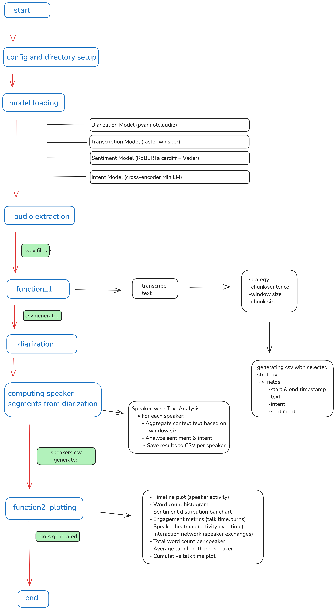

# Communication Analysis Pipeline

## Overview

This repository provides a comprehensive pipeline for analyzing audio-visual communication data. It processes video files to extract audio, perform speaker diarization (identifying *who* spoke *when*), transcribe the speech for each speaker and the overall conversation, conduct sentiment analysis and intent classification on the transcribed text, and finally, generate a rich set of analytical visualizations and detailed CSV reports.



## Project Structure

```
📦 CommAnalysis/
|__ 📂 .github/                 # Github actions for testing.
|__ 📂 .streamlit/              # Streamlit Configuration
|__ 📂 assets/                  # Containing dashboard and CLI logs pdfs.
├── 📂 data/
│   └── 📂 gsocvideos/          # Input video files (or downloaded samples)
├── 📂 outputs/                 # Generated results
│   ├── 📂 exported_audio/      # Extracted WAV/MP3 audio files
│   ├── 📂 csv_files/           # CSV reports (overall, per-speaker)
│   └── 📂 figs/                # Saved plot images generated by main.py
├── 📂 src/                     # Source code
│   ├── 📜 main.py             # Main CLI script for processing pipeline
│   ├── 📜 plotting.py         # Plotting functions (used by main.py)
│   ├── 📜 streamlit_main.py   # Main Streamlit application script
│   └── 📜 streamlit_plotting.py # Plotting functions for Streamlit
├── 📂 tests/                   # Unit and integration tests
│   ├── 📜 test_main.py        # Tests for all models
│   └── 📂 test_data/          # data files for testing
├── 📂 tempdata/                # Temporary files (e.g., audio chunks for processing)
│   └── 📝 (Potentially removable with optimizations)
├── 📂 cache/                   # Cached intermediate results
│   ├── 📂 diarization_cache/   # Cached diarization outputs
│   └── 📂 transcription_cache/ # Cached transcription outputs
├── 📜 requirements.txt        # Python package dependencies
├── 📜 run.sh                   # Script to run CLI analysis
├── 📜 run_st.sh                # Script to launch Streamlit app
└── 📜 README.md               # Readme
```

## Core Functionalities

1.  **Data Preparation:**
    * User-provided videos should be placed in `data/gsocvideos/`. one sample video is downloaded from gdrive if empty.
    * Extracts audio and saves it in WAV format (`.wav`) to `outputs/exported_audio/`. An MP3 version is also exported for use in live analysis.
    * Creates necessary directories for outputs (`outputs/`), caching (`cache/`), and temporary files (`tempdata/`).

2.  **Speaker Diarization:**
    * Employs the `pyannote/speaker-diarization-3.1` pre-trained model.
    * Identifies distinct speakers in the audio and determines the start and end times of their speech segments.
    * Results are saved to `cache/diarization_cache/` to avoid redundant computation on subsequent runs with the same audio file.

3.  **Speech Transcription:**
    * Utilizes the `faster-whisper` library (`small.en` model by default) for speech-to-text conversion. Runs on GPU (CUDA with float16) if available, otherwise CPU (int8).
    * Uses word-level timestamps.
    * Caches transcription results for full audio files and potentially individual speaker segments in `cache/transcription_cache/`.

4.  **Sentiment Analysis:**
    * Applies a hybrid approach for robustness:
        * **NLTK VADER:** A lexicon and rule-based sentiment analysis tool, effective for general sentiment polarity.
        * **CardiffNLP RoBERTa (`cardiffnlp/twitter-roberta-base-sentiment-latest`):** A Transformer-based model. Handles long text by chunking inputs to fit the model's context window.
    * Combines scores (weighted by RoBERTa-0.6 and Vader-0.4) to classify text segments into "Positive", "Negative", or "Neutral".

5.  **Intent Classification:**
    * Uses a `sentence-transformers` `CrossEncoder` model (`cross-encoder/ms-marco-MiniLM-L6-v2`).
    * Classifies text segments based on similarity to predefined driving-related intents (e.g., `change_speed`, `navigation`, `weather_update`, `accident_warning`, etc.). Predicts the most relevant intent for each segment.

6.  **Multiple Granularities Strategies (Overall Conversation):**
    * Analyzes the conversation flow over time based on the chosen strategy (`--st` argument):
        * **`chunk`:** Divides the full transcription into fixed-duration chunks (default 5 seconds, configurable via `--ct`).
        * **`sentence`:** Segments the transcription based on detected sentence boundaries.
    * Applies a sliding window (`--wsz` argument, default 1) to incorporate preceding context (from previous chunks/sentences) when performing sentiment and intent analysis for a given segment. This helps capture context-dependent meanings. window size 1 is just current chunk/sentence.
    * Generates a CSV file in `outputs/csv_files/` (e.g., `{video_base_name}.csv`) containing columns for `start timestamp`, `end timestamp`, `text segment`, `sentiment` and `intent` for each analyzed window.

7.  **Speaker-Specific Analysis:**
    * Segments the audio using the diarization results.
    * Transcribes the audio corresponding to each identified speaker's segments.
    * Performs sentiment and intent analysis on each speaker's transcribed text, potentially applying context windowing within their turns.
    * Generates separate CSV files for each speaker in `outputs/csv_files/` (e.g., `{video_base_name}_SPEAKER_{id}.csv`).

8.  **Visualization & Reporting:**
    * The `plotting.py` and `streamlit_plotting.py` modules generate various visualizations using Matplotlib, Seaborn, Plotly, and NetworkX. Plots are saved to `outputs/figs/` by `main.py` or displayed interactively in the Streamlit app.
    * **Plot Types:**
        * `timeline`: Visualizes speaker activity over the conversation duration.
        * `histogram`: Shows word count per time bucket, color-coded by sentiment.
        * `sentiment`: Displays the overall distribution of Positive, Negative, and Neutral sentiments.
        * `engagement`: Bar charts comparing total talk time and turn count per speaker.
        * `heatmap`: Visualizes the intensity of speaker activity across discretized time bins.
        * `network`: Represents speaker turn-taking and interactions as a graph.
        * `total_words`: Bar chart of the total word count for each speaker.
        * `avg_turn`: Bar chart showing the average duration or word count of a speaker's turn.
        * `cumulative`: Line plot showing the cumulative talk time per speaker as the conversation progresses.

## Requirements

* Python 3.10
* System Dependencies:
    * `ffmpeg`: `sudo apt install ffmpeg`

## For reproducing current results
1.  **Run locally:**
    ```bash
    git clone https://github.com/autobot37/commanalysis.git
    cd commanalysis
    pip install -r requirements.txt
    chmod +x run.sh
    ./run.sh
    ```
2. **Run in Colab**:

   [Colab Link](https://colab.research.google.com/drive/1l1VHl7MU1t9oDu4MCK4xaSOIZ7b1Dxud?usp=sharing)

## Usage by CLI

Logs will look like this : [View Logs (logs.pdf)](https://github.com/Autobot37/CommAnalysis/blob/main/assets/logs.pdf)

    git clone https://github.com/autobot37/commanalysis.git
    cd commanalysis
    pip install -r requirements.txt

1.  **Prepare Input Data:**
    * Place your video files inside the `data/gsocvideos/` directory or pass --gdrive in CLI below.
    * If `data/gsocvideos/` is empty when `main.py` or `streamlit_main.py` runs, the script will automatically download sample videos from Google Drive.
2.  **Make Scripts Executable :**
    ```bash
    chmod +x run.sh
    chmod +x run_st.sh
    ```

3. **Run**
```bash
./run.sh [video_folder] [--st strategy] [--wsz window_size] [--ct chunk_time] [--gdrive gdrive_url] [--hf_token token]
```
Any field can be left empty.

**Arguments:**

* `folder` (Positional): Path to the folder containing video files.
    * *Default:* `data/gsocvideos/`
* `--st` (Strategy): The temporal analysis strategy.
    * Options: `chunk`, `sentence`
    * *Default:* `chunk`
* `--wsz` (Window Size): Number of preceding context units (chunks or sentences) to include for analysis.
    * *Default:* `1`
* `--ct` (Chunk Time): Duration of each chunk in seconds (only used if `--st chunk`).
    * *Default:* `5`
* `--gdrive` (Google Drive URL): Specify a Google Drive folder URL to download videos from if the input folder is empty (overrides the hardcoded default).
    * *Default:* `None` (uses the hardcoded URL if needed)
* `--hf_token` (Hugging Face Token): Your Hugging Face Hub token.
    * *Default:* is given.

**Examples:**

* Run with default settings:
    ```bash
    ./run.sh
    ```
* Run using 'sentence' strategy and window size 3 on videos in `my_videos/`:
    ```bash
    ./run.sh my_videos/ --st sentence --wsz 3
    ```
* Run using 'chunk' strategy with 10-second chunks:
    ```bash
    ./run.sh --st chunk --ct 10
    ```

## Usage via Streamlit Web Interface (`run_st.sh`)

The `run_st.sh` script launches the Streamlit application defined in `src/streamlit_main.py`.

```bash
./run_st.sh
```

This will start a local web server and open the interactive dashboard in your browser.

### Streamlit Application Overview (`src/streamlit_main.py`)

The Streamlit application provides an interactive graphical user interface (GUI) for the communication analysis pipeline.
Logs and `Dashboard Snapshot` can be found here : [Snapshot](https://github.com/Autobot37/CommAnalysis/blob/main/assets)


**Key Points:**

1.  **File Upload:** [Main Page Snapshot](https://github.com/Autobot37/CommAnalysis/blob/main/assets/streamlit_main.pdf)

    * Allows users to upload multiple video files (`.mp4`, `.avi`, `.mov`) directly through the browser interface. Uploaded files are saved to `data/gsocvideos/`.
4.  **Analysis Configuration (Sidebar):**
    * Users can select the analysis strategy (`chunk` or `sentence`).
    * If `chunk` is selected, users can choose the chunk duration (e.g., 5, 10, 15 seconds).
    * Users can select the context window size (e.g., 1, 3, 5).
    * A "Process Videos" button triggers the main analysis pipeline on the videos present in `data/gsocvideos/` (either pre-existing or uploaded).
5.  **Processing:** [Video Processing Snapshot](https://github.com/Autobot37/CommAnalysis/blob/main/assets/streamlit_video_process.pdf)
    * When "Process Videos" is clicked:
        * Iterates through each video file.
        * Displays progress bars for overall video processing and per-video steps (audio export, diarization, text analysis, speaker segment computation).
        * Calls core functions from `src/main.py` (`get_diarization`, `FUNCTION1_results`, `compute_speaker_segments`, `speaker_wise_text_analysis`).

6.  **Results Display:**
    * **Sidebar Buttons:** Allow users to toggle different views:
        * `Show Plots` ([Plots Snapshot](https://github.com/Autobot37/CommAnalysis/blob/main/assets/streamlit_plots.pdf)) : Displays the full suite of visualizations (Timeline, Histogram, Sentiment, Engagement, etc.) generated by `streamlit_plotting.py` using Plotly for interactivity.
        * `Show Speakers Segments` ([Speaker Segments Snapshot](https://github.com/Autobot37/CommAnalysis/blob/main/assets/streamlit_segments.pdf)): Displays the transcribed text for each speaker, broken down by turn, along with start/end times. It includes an audio player for each segment (requires temporary audio snippets created during speaker segment processing). Allows filtering by speaker ("all" or individual).
        * `Show CSV` ([Text Analysis Snapshot](https://github.com/Autobot37/CommAnalysis/blob/main/assets/streamlit_csv.pdf)): Loads the main analysis CSV (`{video_base_name}.csv`), displays the text, sentiment, and intent columns in a styled Pandas DataFrame with color-coding for sentiment (Green/Red/Gray) and background colors for intent.
        * `Live Audio Analysis`([Live Audio Snapshot](https://github.com/Autobot37/CommAnalysis/blob/main/assets/streamlit_live.pdf)): It provides synced playback with speaker wise transcription color coded with sentiment. Intent is also displayed.

## Testing

The `tests/` directory contains scripts to verify the functionality of different pipeline components and is automatically verified by github actions..
* **Test contains:**
    * `test_diarization`: to check if the diarization model correctly identifies speaker segments on sample audio.
    * `test_transcription`: Verifies that the transcription model accurately converts speech in test audio files to text.
    * `test_sentiment.`: Checks if the sentiment analysis module correctly assigns 'Positive', 'Negative', or 'Neutral' labels to predefined text samples.
    * `test_intent`: Ensures the intent classification model assigns the correct intent labels to relevant test phrases or sentences.

* **Running Tests:** Use `pytest` to discover and run the tests.
    ```bash
    pytest
    ```

## Future optimizations and what else can be done.

* **Remove `tempdata/`:** Optimize the audio processing workflow (especially for speaker segment playback in Streamlit) to avoid writing numerous small temporary audio files to disk, potentially using in-memory objects or more efficient slicing.
* **Sentiment/Intent Model Fine-tuning:** For domain-specific improvements, fine-tune the sentiment (RoBERTa) and intent (CrossEncoder) models on driving communication.
* **Resource Management:** Profile memory and CPU/GPU usage, especially during batch processing of many videos, and optimize where possible.
